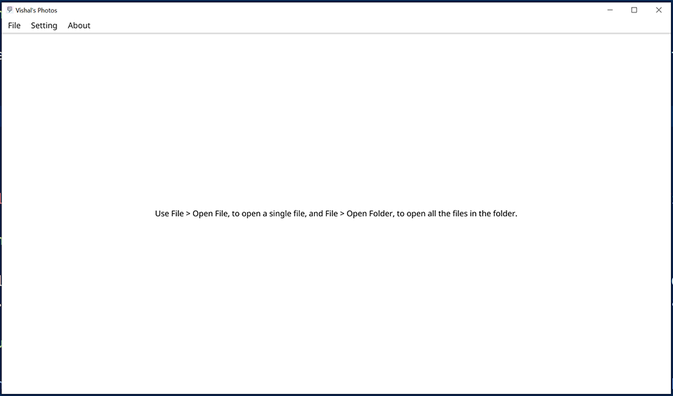
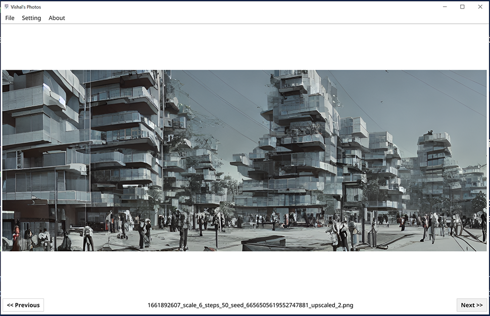

  

# Vishal's Photos

A simple attempt at creating a cross platform photo viewer. Because my Windows install doesn't have a photo viewer which allowed me to view all the photos in a directory.

Feel free to open an argument with me in the issues section.

## Features

- Cross-Platform (Windows build is available on releases page)
- Open single images
- Browse photos one-by-one when you Open a folder
- Uses GPU, if you have one, to accelerate image scaling
- Navigate folders using keyboard.
- Go fullscreen for maximum **i m m e r s i o n**
- I made a cute logo for the app

## Quick How-To

1. Using the 'Open Folder' option in the menu would allow you to open a folder. All images that are of the type `.jpg` or `.png` would then be available for display.
2. While a folder of images is opened you can use the `Left` and `Right` keys to browse forward and backward through the folder of files.

## Screenshots

Screenshot 1 | Screenshot 2
:-------------------------:|:-------------------------:
  |  

## Get it

Vist the [releases page](https://github.com/VishalRamki/vishals-photos/releases) to get the latest version.

## Limitations

I don't really like the file dialog, but it works for now. This entire project is written in Golang using the Fyne library. It was way more accesible than the current alternatives. However, that came at a cost. 

## Legal

This code is released under the MIT License. For no real reason. 